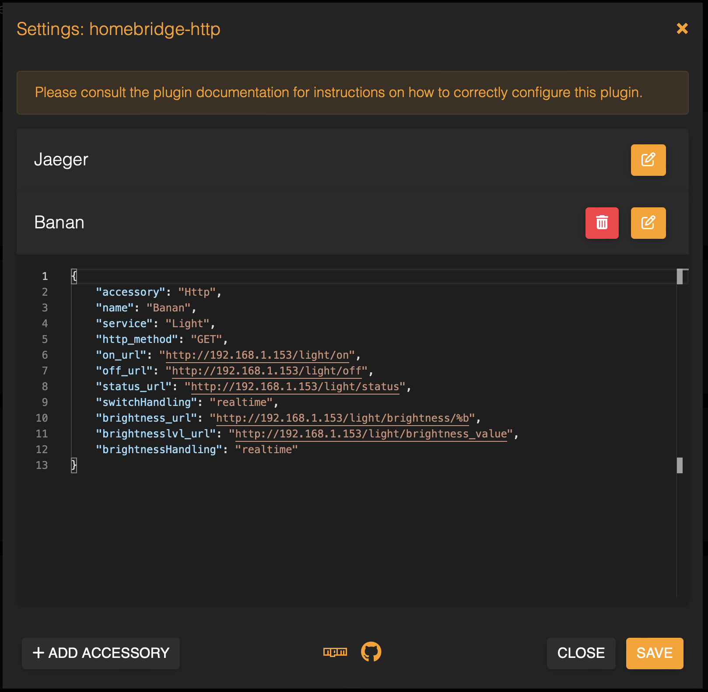

# Raspberry Pico W Homebridge accessory

Micropython implementation of custom https server of homebridge accessory

## Homebridge plugin installation

To integrate this pico accessory with Apple Home Kit you'll need [Homebridge](https://homebridge.io) instance and [Http plugin](https://github.com/rudders/homebridge-http).

1. Open your __Homebridge__ Dashboard
1. Select __Plugins__ on navbar
1. Enter `homebridge-http` in the search box
1. Install the __Homebridge Http__ plugin by __rudders__

1. Click on settings and add new accessory
1. Configure your accessory api with its IP address or dns name


## Example plugin configuration

```json
{
     "accessory": "Http",
     "name": "Pico-Dev",
     "service": "Light",
     "http_method": "GET",
     "on_url": "http://192.168.1.206/light/on",
     "off_url": "http://192.168.1.206/light/off",
     "status_url": "http://192.168.1.206/light/status",
     "switchHandling": "realtime",
     "brightness_url": "http://192.168.1.206/light/brightness?value=%b",
     "brightnesslvl_url": "http://192.168.1.206/light/brightness_value",
     "brightnessHandling": "realtime"
}
```

## Homebridge http accessory plugin issues

There are unresolved issues with http plugin. To fix it, log into Homebridge server using ssh and edit `/usr/lib/node_modules/homebridge-http/index.js` file.

### Prevent homebridge restart on error

line 47: callback(error) -> done(null)

### Decrease poll interval, so pico can keep up with responding

line 50: interval:300 -> interval:700

## Testing

You can easily test server implementation using curl e.g. `curl -vvvv http://192.168.1.206/light/on`

## TODO

- describe how to install code on Pico W using Thonny
- add wiring diagram
- describe how to configure wifi credentials using settings-editor.py
